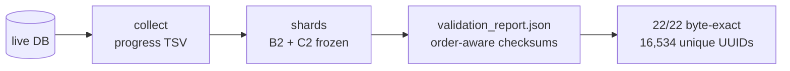

# safety-review-gate

> **The evidence locker for the safety-review gate investigation — run-ID backfill artifacts, checksummed and verified.**

<div align="right">

[](https://github.com/toxicwind/safety-review-gate/tree/main/backfill-20260917)
[](https://github.com/toxicwind/safety-review-gate/tree/main/backfill-20260917)
[](https://github.com/toxicwind/safety-review-gate/tree/main/backfill-20260917)

</div>

On 2026-09-17 the safety-review gate needed its run ledger backfilled: every run ID, every page, provably complete. This repo is the artifact of that investigation — frozen shards, a timestamped progress log with defect disclosures, and a machine-readable validation report.

**Why care:** 16,534 unique run UUIDs across five shards, zero overlap across all ten shard pairs, 22/22 pages byte-exact against the live database via order-aware checksums. If you need to re-verify the gate's history, start here — the md5s are in the manifest below.

> **License:** none declared — investigation artifacts, treat as all-rights-reserved until declared. **Security:** shards contain run IDs and progress metadata only — no credentials, no secrets, no PII. That's deliberate: the ledger is safe to share, the database stays private.

## Contents

- `backfill-20260917/shard-b2-20260917.txt` — 1,710 rows, md5 `e17c3d2025255df2e23aa59341e905f1`
- `backfill-20260917/shard-c2-20260917.txt` — 2,223 rows, md5 `d90ae62cdd2d3b187492dc6bdc7ca80f`
- `backfill-20260917/progress-b2c2-20260917-v3.tsv` — full progress log with defect disclosures
- `backfill-20260917/validation_report.json` — machine-readable validation results
- `backfill-20260917/README.md` — the original backfill manifest

## Verification

- **22/22 pages** byte-exact vs the live DB via order-aware checksums
- **16,534 unique UUIDs** — A(4,621) + B_frozen(5,220) + C_frozen(2,760) + B2(1,710) + C2(2,223)
- **Zero overlap** across all 10 shard pairs; zero internal dupes; zero malformed rows
- `row_expectations_met: true` in `validation_report.json`



## Quick start

```bash
git clone https://github.com/toxicwind/safety-review-gate.git
cd safety-review-gate/backfill-20260917
md5sum shard-b2-20260917.txt   # expect e17c3d2025255df2e23aa59341e905f1
```

## Reading the report

`validation_report.json` is the machine-readable verdict: per-file row/unique counts, `internal_dupes`, all ten `cross_overlaps`, `malformed` counts, and the union totals. The progress TSV is the human-readable trail — timestamped phases (`collect`, …) with anchor UUIDs and defect disclosures inline.

## License + security

- **License:** none declared — investigation artifacts, treat as all-rights-reserved until declared.
- **Contents are run IDs + progress metadata** — no credentials, no secrets, no PII. That's deliberate: the ledger is safe to share, the DB stays private.
